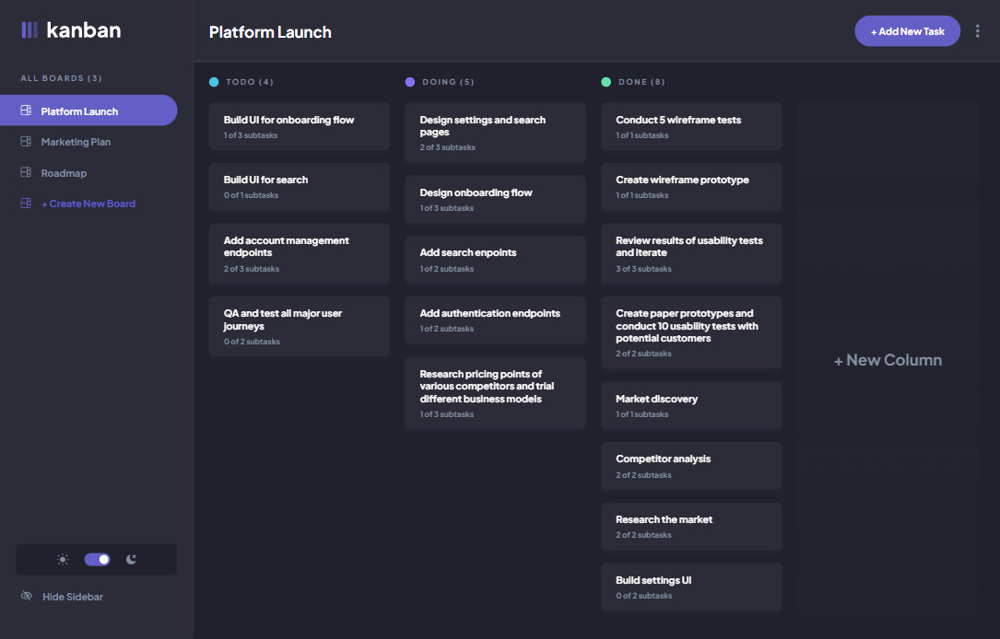

# Frontend Mentor - Kanban task management web app solution

This is a solution to the [Kanban task management web app challenge on Frontend Mentor](https://www.frontendmentor.io/challenges/kanban-task-management-web-app-wgQLt-HlbB). Frontend Mentor challenges help you improve your coding skills by building realistic projects.

## Table of contents

- [Overview](#overview)
  - [The challenge](#the-challenge)
  - [Screenshot](#screenshot)
  - [Links](#links)
- [Built with](#built-with)
- [Author](#author)

## Overview

### The challenge

Users should be able to:

- View the optimal layout for the app depending on their device's screen size
- See hover states for all interactive elements on the page
- Create, read, update, and delete boards and tasks
- Receive form validations when trying to create/edit boards and tasks
- Mark subtasks as complete and move tasks between columns
- Hide/show the board sidebar
- Toggle the theme between light/dark modes
- **Bonus**: Allow users to drag and drop tasks to change their status and re-order them in a column
- **Bonus**: Keep track of any changes, even after refreshing the browser (`localStorage` could be used for this if you're not building out a full-stack app)

### Screenshot

### Links

- Solution URL: [Add solution URL here](https://www.frontendmentor.io/solutions/task-management-app-with-draganddrop-react-typescript-sass-ASVYgvkREY)
- Live Site URL: [lukakobaidze-taskmanagement.netlify.app](https://lukakobaidze-taskmanagement.netlify.app)

## Built with

- [React](https://react.dev/)
- [TypeScript](https://www.typescriptlang.org/)
- [Sass](https://sass-lang.com/)
- [React Redux](https://react-redux.js.org/)
- [Redux Toolkit](https://redux-toolkit.js.org/)
- [react-beautiful-dnd](https://github.com/atlassian/react-beautiful-dnd)
- [react-indiana-drag-scroll](https://github.com/norserium/react-indiana-drag-scroll)
- [focus-trap-react](https://github.com/focus-trap/focus-trap-react)

## Author

- Frontend Mentor - [@LukaKobaidze](https://www.frontendmentor.io/profile/LukaKobaidze)
